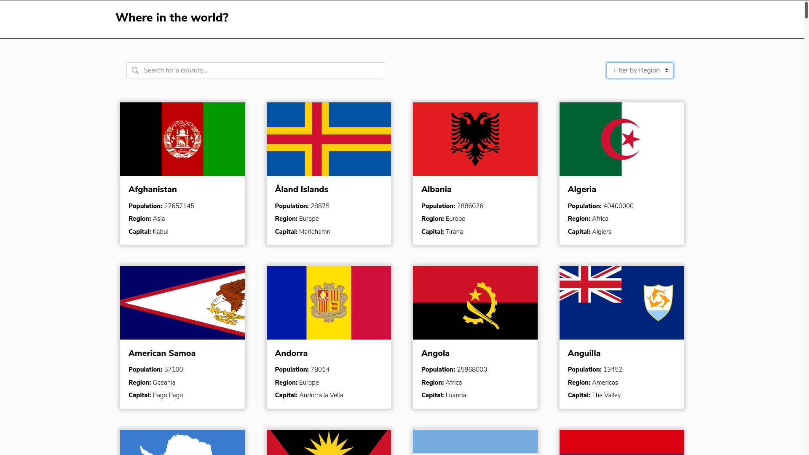
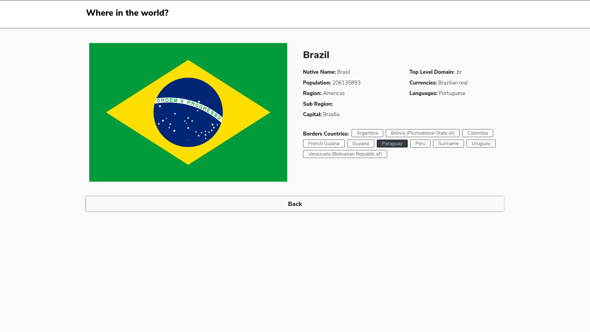

# Tours Project

## Table of contents
* [General info](#general-info)
* [Features](#features)
* [Technologies](#technologies)
* [Ilustrations](#ilustrations)
* [Setup](#setup)

## General info
A front-end client side rendering project, built using React.js, Redux, Bootstrap, HTML y CSS. 
I wanted to learn more about React.js, and practice a bit of front end. 
* or check out the final result [Here](https://flags-api-react-redux.vercel.app/).

## Features
* Search for a country
* Filter countries.
* Check specific info about a country 
	
## Technologies
Project is created with:
* React.js
* Redux
* Bootstrap.js
* HTML
* CSS

## Ilustrations


	
## Setup
To run this project, install it locally using npm:

```
$ npm install
$ npm start
```


